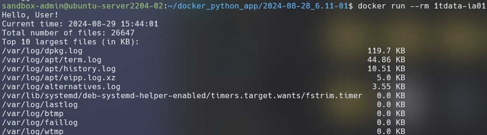
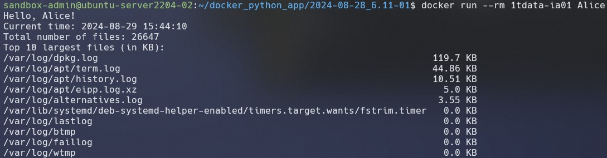

# 2024-08-28_6.11-01

## Итоговая аттестация. Задание 1
Торшин Сергей

### Docker образ
Docker команда
```bash
docker push torshin5ergey/1tdata-ia01:latest
```

### Запуск 
1. Запуск без аргумента (по умолчанию приветствие для User).
    ```bash
    docker run --rm torshin5ergey/1tdata-ia01
    ```
    

2. Запуск с аргументом.
    ```bash
    docker run --rm torshin5ergey/1tdata-ia01 Alice
    ```
    

Ссылка на образ в Docker Hub: https://hub.docker.com/repository/docker/torshin5ergey/1tdata-ia01/general
